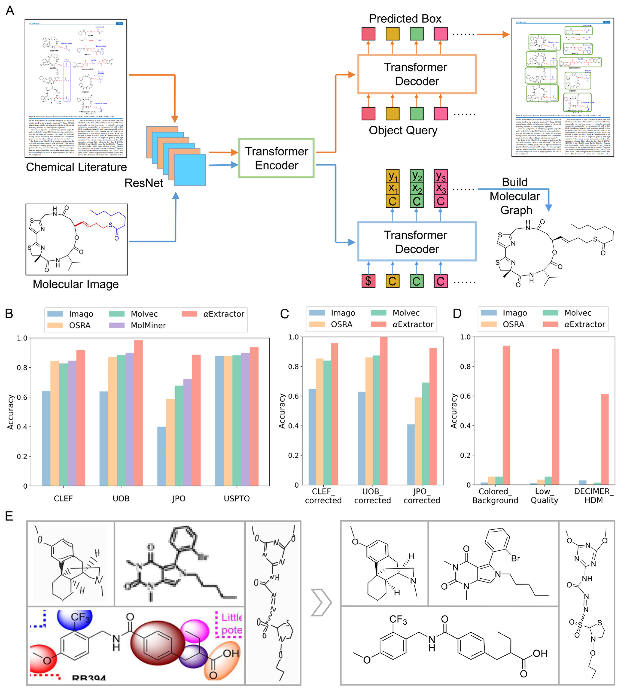

# alpha-Extractor

This GitHub repository contains the test data  for paper “αExtractor: a system for automatic extraction of chemical information from biomedical literature”

αExtractor is an online server developed by AlphaMa and SIMM for automatic extraction of chemical structure from literature. With high recognition accuracy and fast processing speed, αExtractor may facilitate automated chemical literature mining and data-driven drug design.

The molecular image recognition model in αExtractor is an improved version of our winning model in the [Bristol-Myers Squibb – Molecular Translation competition]([https://extractor.alphama.com.cn/csr](https://www.kaggle.com/competitions/bms-molecular-translation)). It not only performs outstandingly on some common benchmark data sets, but also can recognize molecular images with background, low quality, and even hand-drawn molecular images. Furthermore, unlike conventional molecular translation models, which only predict molecular SMILES or InChI, αExtractor can also predict the atomic positions and bond types in the image to reconstruct the molecular graph.

